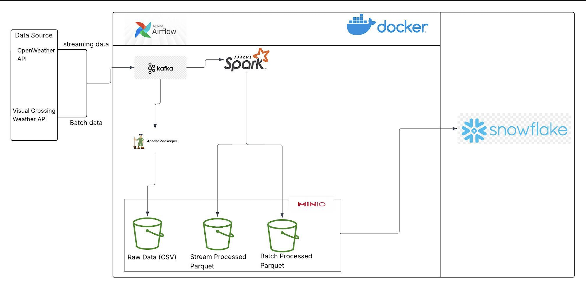

# 🌦️ Real-Time Weather Data Pipeline  
**Big Data Final Project – ISM 6562**

---

## 🧭 Table of Contents

1. [Overview]
2. [Technology Overview and Rationale]  
3. [Architecture Diagram] 
4. [System Requirements]  
5. [Prerequisites]  
6. [Setup and Deployment Instructions] 
7. [Use Case Description]  
8. [Technologies and Services Used]  
9. [Troubleshooting]  
10. [License]

---

## 1. Overview  

This project implements a real-time weather data pipeline that continuously collects, processes, and stores live weather information using a modern big data stack. The workflow integrates OpenWeatherMap API, Kafka, Spark, MinIO, Snowflake, and Airflow, all containerized with Docker Compose.

The system begins by fetching weather data from OpenWeatherMap for multiple cities and publishing it to a Kafka topic. Kafka enables reliable streaming ingestion, while Spark processes this data—cleaning, aggregating, and converting it into analytics-ready Parquet files. These results are stored in MinIO (serving as an on-premise S3 data lake) and periodically loaded into Snowflake for long-term storage and analytics.

Airflow orchestrates the entire workflow through two DAGs:

**weather_batch_pipeline for daily batch processing**, and

**weather_stream_pipeline for hourly streaming loads.**

This architecture demonstrates how real-time APIs can feed scalable, fault-tolerant pipelines that transform raw JSON data into structured warehouse tables ready for visualization and predictive analytics. It serves as a practical blueprint for IoT, environmental monitoring, or smart-city data systems.

---

## 2. Technology Overview and Rationale  

| Technology | Purpose | Why It Was Chosen |
|-------------|----------|------------------|
| **Apache Kafka** | Real-time message streaming | Provides high-throughput, fault-tolerant pub/sub data ingestion |
| **Apache Spark** | ETL and aggregation engine | Enables distributed data transformation and streaming analytics |
| **MinIO** | Data lake storage | Acts as an S3-compatible storage layer for both raw and processed data |
| **Snowflake** | Cloud data warehouse | Provides scalable, analytics-ready storage for structured results |
| **Apache Airflow** | Workflow orchestration | Automates and schedules daily/hourly data pipeline tasks |
| **OpenWeatherMap API** | Data source | Reliable, free, real-time weather data provider |
| **Docker Compose** | Container orchestration | Ensures isolated, reproducible multi-service deployment |

This technology stack was designed to reflect a real-world big data ecosystem, seamlessly integrating **streaming ingestion**, **distributed processing**, **scalable storage**, and **automated orchestration** into a cohesive end-to-end pipeline.

---

## 3. Architecture Diagram  

### Text-Based Architecture



---

## 4. System Requirements  

| Component | Minimum Version | Purpose |
|------------|----------------|----------|
| Python | 3.10+ | Producer, Consumer, and Loader scripts |
| Docker & Docker Compose | Latest | Container orchestration |
| Apache Airflow | 2.8+ | DAG scheduling |
| Apache Spark | 3.5+ | Data processing |
| Kafka | 7.6 (Confluent) | Real-time message streaming |
| Snowflake Account | Any free/paid tier | Cloud data warehouse |
| MinIO | Latest | Local S3-compatible storage |
| OpenWeatherMap API Key | Active key required | Data source |

---

## 5. Prerequisites  

Before setup, ensure you have:

- Docker & Docker Compose are installed and running  
- Snowflake account credentials (Free or Paid tier)
- An active OpenWeatherMap API key 
- `.env` file configured in the project root:

```bash
OPENWEATHER_API_KEY=your_api_key_here
KAFKA_BOOTSTRAP_SERVERS=localhost:29092
KAFKA_TOPIC_REALTIME=weather-realtime
CITIES=Tampa,Miami,Orlando,Jacksonville,Tallahassee
SNOWFLAKE_USER=YOUR_USER
SNOWFLAKE_PASSWORD=YOUR_PASSWORD
SNOWFLAKE_ACCOUNT=YOUR_ACCOUNT
SNOWFLAKE_DATABASE=WEATHERDATA
SNOWFLAKE_SCHEMA=PUBLIC
```

---

## 6. Setup and Deployment Instructions  

### Step 1: Locate the ZIP file provided (e.g., BigdataFinalProject.zip) and Extract it.
- unzip BigdataFinalProject.zip
- cd BigdataFinalProject

### Step 2: Start all Docker services
```bash
docker-compose up -d
```
This spins up:
- Kafka + Zookeeper  
- Spark (master + worker + client)  
- Airflow (scheduler + webserver)  
- MinIO  
- PostgreSQL (Airflow metadata DB)

### Step 3: Initialize Airflow
```bash
docker exec -it bigdatafinalproject-airflow-webserver-1 airflow dags list
```

### Step 4: Run the DAGs
- **Batch pipeline**: `weather_batch_pipeline` (runs daily)  
- **Stream pipeline**: `weather_stream_pipeline` (runs hourly)

Trigger manually for testing:
```bash
docker exec -it bigdatafinalproject-airflow-webserver-1 airflow dags trigger weather_stream_pipeline
```

### Step 5: Verify Kafka Stream
```bash
kafka-console-consumer --bootstrap-server localhost:29092 --topic weather-realtime --from-beginning
```

### Step 6: Check Snowflake tables
```sql
SELECT * FROM WEATHERDATA.PUBLIC.STREAM_WEATHER_METRICS;
```

---

## 7. Use Case Description  

This project models a real-time data engineering pipeline for meteorological and smart city applications. It continuously collects live environmental data **(temperature, humidity, pressure, wind speed)**, processes it using **Kafka** and **Spark**, stores it in **MinIO**, and loads it into **Snowflake** for analytics.

The same architecture can be adapted for:
- **IoT sensor monitoring**
- **Traffic flow and pollution analysis**
- **Energy consumption forecasting**

---

## 8. Technologies and Services Used  

| Category | Technologies |
|-----------|---------------|
| Data Ingestion | OpenWeatherMap API, Apache Kafka |
| Data Processing | Apache Spark (ETL jobs) |
| Orchestration | Apache Airflow |
| Storage | MinIO (raw & processed zones), Snowflake |
| Deployment | Docker Compose |
| Language | Python (Producer, Consumer, Loader scripts) |
| DataWarehouse| Snowflake |

---

## 9. Troubleshooting  

| Issue | Possible Cause | Solution |
|--------|----------------|-----------|
| ❌ `Failed to resolve 'kafka:9092'` | Running locally, not in Docker network | Set `KAFKA_BOOTSTRAP_SERVERS=localhost:29092` in `.env` |
| ⚠️ `OPENWEATHER_API_KEY missing` | .env file not loaded | Create `.env` and restart script |
| ❌ Snowflake connection error | Wrong credentials or warehouse | Verify `.env` values and Snowflake account name |
| ⚠️ MinIO “No such key” | Processed data not yet written | Wait for Spark ETL job to finish |
| ❌ Airflow not starting | Permission or port issue | Run `docker-compose down && docker-compose up -d` to reset containers |
| ❌ Access Denied on MinIO|Incorrect credentials or bucket policy|`Check MINIO_ROOT_USER / MINIO_ROOT_PASSWORD in .env`|

---

## 10. Requirements and References 

---

System Requirements
|Component|Minimum Version|Purpose|
|Python| 3.10+|Producer, Consumer, and Loader scripts|
|Docker & Docker Compose|Latest Container orchestration|
|Apache Airflow|2.8+|DAG scheduling and workflow automation|
|Apache Spark|3.5+|Batch and streaming ETL processing|
|Kafka (Confluent Platform)|7.6+|Real-time message streaming|
|Snowflake Account|Free or Paid Tier|Cloud data warehouse|
|MinIO|Latest|Local S3-compatible storage|
|OpenWeatherMap| API Key|Active Key Required|Live weather data source|
|VisualCrossing|API Key|Active Key Required|Live weather data source|

---

- Apache Software Foundation. (2025). Apache Kafka documentation. Retrieved from https://kafka.apache.org/documentation/

- Apache Software Foundation. (2025). Apache Spark structured streaming programming guide. Retrieved from https://spark.apache.org/docs/latest/structured-streaming-programming-guide.html

- Apache Software Foundation. (2025). Apache Airflow official documentation. Retrieved from https://airflow.apache.org/docs/

- MinIO, Inc. (2025). MinIO developer documentation. Retrieved from https://min.io/docs/

- Snowflake Inc. (2025). Snowflake documentation. Retrieved from https://docs.snowflake.com/

- OpenWeather Ltd. (2025). OpenWeatherMap API reference. Retrieved from https://openweathermap.org/api

- VisualCrossing Corporation. (2025). VisualCrossing weather API reference. Retrieved from https://www.visualcrossing.com/resources/documentation/weather-api/

- Docker, Inc. (2025). Docker Compose reference. Retrieved from https://docs.docker.com/compose/
